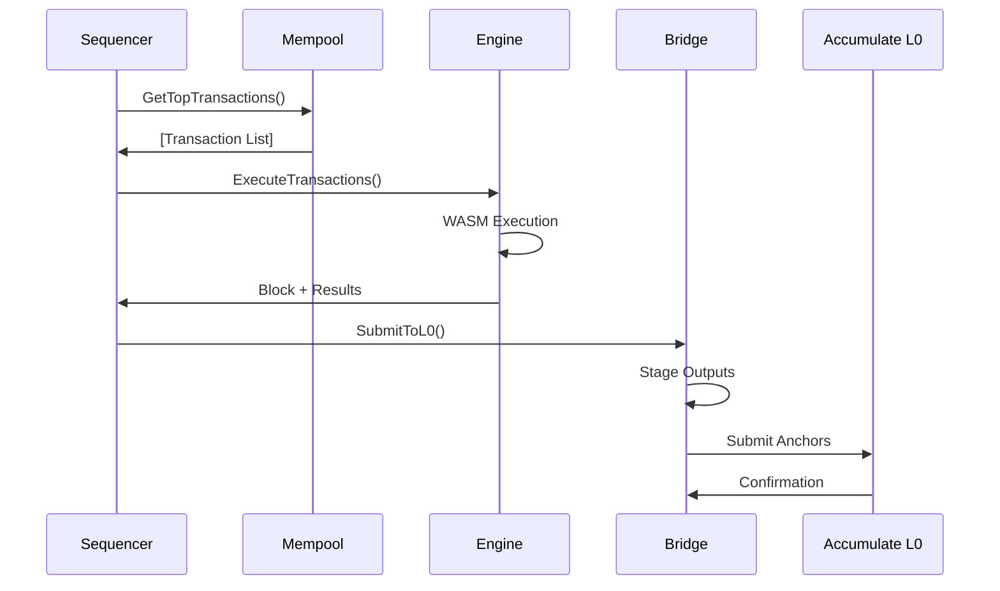

# Accumen Architecture

Accumen is a Layer 1 sequencer designed to provide deterministic WASM execution with seamless integration to the Accumulate Layer 0 network. This document outlines the high-level architecture and key components.

## Overview

```
┌─────────────────────────────────────────────────────────────────┐
│                          Accumen L1                            │
├─────────────────────────────────────────────────────────────────┤
│  ┌─────────────┐  ┌─────────────┐  ┌─────────────┐            │
│  │  Mempool    │  │ Sequencer   │  │   Engine    │            │
│  │   (Tx       │  │   Loop      │  │   (WASM     │            │
│  │  Ordering)  │  │             │  │ Execution)  │            │
│  └─────────────┘  └─────────────┘  └─────────────┘            │
│         │                 │                 │                  │
│         └─────────────────┼─────────────────┘                  │
│                           │                                    │
│  ┌─────────────────────────────────────────────────────────┐   │
│  │                Bridge Layer                            │   │
│  │  ┌─────────────┐  ┌─────────────┐  ┌─────────────┐    │   │
│  │  │   Output    │  │   Output    │  │    L0 API   │    │   │
│  │  │  Staging    │  │ Submission  │  │   Client    │    │   │
│  │  └─────────────┘  └─────────────┘  └─────────────┘    │   │
│  └─────────────────────────────────────────────────────────┘   │
├─────────────────────────────────────────────────────────────────┤
│                     Accumulate L0                              │
│              (Directory Network & Validators)                  │
└─────────────────────────────────────────────────────────────────┘
```

## Core Components

### 1. Sequencer Loop (`sequencer/loop.go`)

The main orchestrator that coordinates all subsystems:

- **Block Production**: Creates blocks at regular intervals
- **Transaction Processing**: Manages the flow from mempool to execution
- **State Management**: Maintains current block height and sequencer state
- **Bridge Integration**: Coordinates with L0 bridge for anchoring

**Key Responsibilities:**
- Fetch transactions from mempool
- Execute transactions via the engine
- Submit results to L0 bridge
- Generate metadata and receipts

### 2. Mempool (`sequencer/mempool.go`)

Priority-based transaction pool with account-level limits:

- **Priority Queuing**: Orders transactions by gas price and priority
- **Account Limits**: Prevents spam from individual accounts
- **Automatic Cleanup**: Removes expired and invalid transactions
- **Gas Estimation**: Integrates with credit manager for pricing

**Features:**
- Thread-safe concurrent access
- Configurable size and age limits
- Account-based transaction limiting
- Priority-based ordering

### 3. Execution Engine (`sequencer/exec.go`)

Multi-worker transaction execution with WASM runtime:

- **Parallel Processing**: Multiple workers for concurrent execution
- **WASM Integration**: Deterministic execution via wazero runtime
- **Gas Metering**: Precise gas consumption tracking
- **State Management**: Thread-safe key-value store

**Architecture:**
- Worker pool for parallel execution
- Queue-based task distribution
- Deterministic WASM runtime
- Gas limit enforcement

### 4. AccuWASM Runtime (`engine/runtime/`)

Deterministic WASM execution environment:

#### Host API (`engine/host/abi.go`)
- **State Operations**: `get`, `set`, `delete`, iterator functions
- **Transaction Context**: Access to tx ID, sender, data
- **Gas Functions**: Remaining gas, gas consumption
- **Block Context**: Height, timestamp access
- **Logging**: Structured logging from WASM

#### Runtime (`engine/runtime/runtime.go`)
- **Wazero Integration**: Deterministic WASM execution
- **Memory Limits**: Configurable memory constraints
- **Gas Metering**: Integration with gas meter
- **Module Loading**: WASM bytecode compilation and caching

#### Host Bindings (`engine/runtime/host_bindings.go`)
- **Function Registration**: Maps host functions to WASM imports
- **Type Safety**: Proper parameter and return type handling
- **Error Handling**: Safe error propagation

## Security Model

### Authority Binding

Accumen's security model is built on the principle that **L0 owns the keys** - all authority derives from Accumulate's identity and key management system.

```
┌─────────────────────────────────────────────────────────────────┐
│                    Authority Chain                             │
├─────────────────────────────────────────────────────────────────┤
│                                                                 │
│  ADI (acc://example.acme)                                      │
│    │                                                           │
│    └─► Key Book (acc://example.acme/book)                     │
│         │                                                      │
│         └─► Key Page (acc://example.acme/book/1)              │
│              │                                                 │
│              └─► Signer (Public Key + Permissions)            │
│                   │                                            │
│                   └─► Contract Authority Binding              │
│                        │                                       │
│                        └─► L1 Contract (acc://example.acme/contract) │
│                                                                 │
└─────────────────────────────────────────────────────────────────┘
```

**Authority Binding Process:**

1. **ADI Creation**: Create an Accumulate Digital Identifier on L0
2. **Key Management**: Establish key books and key pages with public keys
3. **Contract Binding**: Bind L1 contract addresses to specific key pages
4. **Permission Verification**: All L1 operations verified against L0 key authority

**Authority Registry (`registry/authority/`):**
- **Binding Storage**: Maps contract addresses to key books/pages
- **Permission Cache**: Caches authority scopes for performance
- **Verification Engine**: Validates operations against L0 authority

**Security Properties:**
- **L0 Root of Trust**: All authority derives from Accumulate identity system
- **Non-Repudiation**: Every L1 operation traceable to L0 identity
- **Decentralized Authority**: No centralized key management required
- **Hierarchical Permissions**: Supports complex permission structures

### Authority Scope Management

Authority scopes define what operations a contract is permitted to perform:

```yaml
# Authority Scope Document (stored on DN)
contract: "acc://example.acme/contract"
version: 1
paused: false
allowed:
  write_data:
    - target: "acc://data.acme/*"
      max_size: 1048576
      max_per_block: 10
  send_tokens:
    - from: "acc://example.acme/tokens"
      to: "acc://treasury.acme/*"
      token_url: "acc://ACME"
      max_amount: 1000000000
      max_per_block: 5
  update_auth:
    - target: "acc://example.acme/book/*"
      operations: ["add_authority"]
      max_per_block: 1
```

**Scope Features:**
- **Granular Permissions**: Fine-grained control over allowed operations
- **Rate Limiting**: Per-block operation limits prevent abuse
- **Emergency Controls**: Pause contracts via scope updates
- **Versioned Updates**: Atomic scope updates with version bumping

## Economics Model

### Credits Manager

Accumen uses a **dual-token economics model** where L1 gas is converted to L0 Credits through ACME burning:

```
┌─────────────────────────────────────────────────────────────────┐
│                    Credits Flow                                │
├─────────────────────────────────────────────────────────────────┤
│                                                                 │
│  L1 Transaction (Gas: 50,000)                                 │
│         │                                                       │
│         ▼                                                       │
│  Gas-to-Credits Conversion (GCR: 1000)                        │
│         │                                                       │
│         ▼                                                       │
│  Credits Required: 50 Credits                                  │
│         │                                                       │
│         ▼                                                       │
│  Check Key Page Credit Balance                                  │
│         │                                                       │
│         ├─► Sufficient Credits: Execute Transaction            │
│         │                                                       │
│         └─► Insufficient Credits: Trigger AddCredits           │
│                      │                                          │
│                      ▼                                          │
│             ACME → Credits Conversion                           │
│             (Burn ACME, Issue Credits)                         │
│                      │                                          │
│                      ▼                                          │
│             Retry Transaction Execution                         │
│                                                                 │
└─────────────────────────────────────────────────────────────────┘
```

**Credits Manager (`bridge/pricing/`):**

**Gas-to-Credits Conversion:**
```go
type Schedule struct {
    GCR        float64  // Gas-to-Credits Ratio (e.g., 1000 gas = 1 credit)
    PerByte    ByteCosts // Read/write costs per byte
    HostCosts  map[string]uint64 // Host function gas costs
    BaseGas    uint64   // Minimum gas per transaction
}

// Convert L1 gas usage to L0 credits
credits := gasUsed / schedule.GCR
```

**AddCredits Flow:**
1. **Credit Check**: Verify key page has sufficient credits
2. **ACME Calculation**: Determine ACME required for credit top-up
3. **Token Transfer**: Use configured funding token account
4. **AddCredits Transaction**: Submit to L0 to burn ACME for credits
5. **Retry Execution**: Re-execute L1 transaction with credits

**Funding Configuration:**
```yaml
credits:
  minBuffer: 1000     # Maintain minimum 1000 credits
  target: 5000        # Refill to 5000 credits
  fundingToken: "acc://example.acme/tokens"  # ACME token account
```

**Economic Properties:**
- **Pay-per-Use**: Only pay for actual gas consumption
- **Automatic Top-up**: Seamless credit management
- **ACME Burn**: Deflationary pressure on ACME token
- **Predictable Costs**: Stable gas-to-credit conversion rates

## Cross-Links

Cross-links establish the connection between L1 transactions and their L0 anchored metadata, enabling full auditability and follower synchronization.

### L1 → L0 Cross-Link Process

```
┌─────────────────────────────────────────────────────────────────┐
│                 Cross-Link Flow                                │
├─────────────────────────────────────────────────────────────────┤
│                                                                 │
│  1. L1 Transaction Execution                                   │
│     ├─► TxHash: 0xa1b2c3d4...                                  │
│     ├─► Result: Success                                         │
│     └─► Metadata: {contract, entry, events, l0Outputs}        │
│                                                                 │
│  2. Cross-Link Metadata Generation                             │
│     ├─► L1Hash: 0xa1b2c3d4... (from step 1)                  │
│     ├─► Contract: acc://example.acme/contract                  │
│     ├─► Entry: increment                                        │
│     └─► Outputs: [WriteData, SendTokens]                       │
│                                                                 │
│  3. L0 WriteData Transaction                                   │
│     ├─► Target: acc://dn.acme/registry/metadata/{hash}        │
│     ├─► Memo: "crosslink:0xa1b2c3d4..."                       │
│     ├─► Metadata: {action: "l1_metadata", l1Hash: "0xa1b2c3d4"} │
│     └─► Data: JSON(metadata)                                   │
│                                                                 │
│  4. DN Storage                                                  │
│     └─► Path: registry/metadata/{block_height}/{tx_index}      │
│                                                                 │
└─────────────────────────────────────────────────────────────────┘
```

### Cross-Link Format

**L0 Transaction Memo:**
```
crosslink:0xa1b2c3d4e5f6789012345678901234567890abcdef1234567890abcdef123456
```

**L0 Transaction Metadata:**
```json
{
  "action": "l1_metadata",
  "l1Hash": "0xa1b2c3d4e5f6789012345678901234567890abcdef1234567890abcdef123456",
  "contract": "acc://example.acme/contract",
  "entry": "increment",
  "timestamp": 1640995200
}
```

**DN Metadata Document:**
```json
{
  "chainId": "accumen-devnet-1",
  "blockHeight": 1234,
  "txIndex": 0,
  "txHash": "0xa1b2c3d4e5f6789012345678901234567890abcdef1234567890abcdef123456",
  "time": "2024-01-01T12:00:00Z",
  "contractAddr": "acc://example.acme/contract",
  "entry": "increment",
  "gasUsed": 5000,
  "creditsL0": 50,
  "creditsL1": 5,
  "l0Outputs": [
    {
      "type": "WriteData",
      "target": "acc://data.acme/results",
      "data": "eyJyZXN1bHQiOiJzdWNjZXNzIn0="
    }
  ],
  "events": [
    {
      "type": "counter_incremented",
      "data": {"old_value": 41, "new_value": 42}
    }
  ]
}
```

### Follower Receipt Verification

Followers use cross-links to verify and reconstruct L1 state:

1. **DN Scanning**: Scan DN registry paths for metadata entries
2. **Cross-Link Extraction**: Parse L1 hash from memo field
3. **Metadata Validation**: Verify metadata integrity and authenticity
4. **State Reconstruction**: Apply events and L0 outputs in order
5. **Receipt Generation**: Create L1 receipts linking to DN transactions

**Receipt Structure:**
```json
{
  "l1Hash": "0xa1b2c3d4...",
  "dnTxId": "0x789abc...",
  "dnKey": "registry/metadata/1234/0",
  "contract": "acc://example.acme/contract",
  "entry": "increment",
  "metadata": { /* full metadata object */ },
  "anchorTxIds": ["0xdef456..."],
  "createdAt": "2024-01-01T12:00:00Z"
}
```

### Cross-Link Security Properties

- **Tamper Evidence**: Any modification to L1 metadata breaks cross-link verification
- **Ordering Guarantees**: DN block height ensures deterministic transaction ordering
- **Non-Repudiation**: L0 signatures provide cryptographic proof of authenticity
- **Audit Trail**: Complete transaction history preserved in DN registry
- **State Verification**: Followers can independently verify L1 state transitions

### 5. Bridge Layer (`bridge/`)

Connects Accumen to Accumulate L0 network:

#### L0 API Client (`bridge/l0api/`)
- **JSON-RPC Client**: Accumulate API v3 integration
- **Query Operations**: Account, transaction, directory queries
- **Retry Logic**: Robust error handling and retries
- **Health Monitoring**: Connection health checks

#### Output Management (`bridge/outputs/`)
- **Staging**: Batches outputs for efficient submission
- **Submission**: Multi-worker submission pipeline
- **Verification**: Cryptographic verification of outputs
- **Limits**: Resource and rate limiting

#### Anchoring (`bridge/anchors/`)
- **DN Writer**: Writes transaction metadata to Directory Network
- **Metadata Builder**: Constructs structured metadata from receipts
- **Batch Processing**: Efficient batch submission
- **Cost Calculation**: Integration with credit pricing

#### Pricing (`bridge/pricing/`)
- **Credit Management**: ACME credit system integration
- **Dynamic Pricing**: Gas and priority-based pricing
- **Cost Estimation**: Transaction cost prediction

### 6. Registry Integration (`registry/dn/`)

Directory Network client for protocol parameters:

- **Gas Schedule**: Retrieves current gas costs
- **Opcode Table**: Gets supported WASM opcodes
- **Reserved Labels**: Checks for reserved account names
- **Anchor Submission**: Submits anchors to DN

### 7. State Management (`engine/state/`)

Thread-safe state storage and receipts:

#### KV Store (`engine/state/kv.go`)
- **Thread Safety**: Concurrent read/write operations
- **Iterator Support**: Prefix-based key iteration
- **Memory Efficiency**: Optimized for high-throughput

#### Receipts (`engine/state/receipt.go`)
- **Execution Records**: Complete execution metadata
- **State Changes**: Detailed diff tracking
- **Gas Accounting**: Precise gas consumption records
- **Log Aggregation**: Structured log collection

### 8. Type System (`types/`)

Structured data types and code generation:

#### JSON Schema (`types/json/`)
- **Metadata Schema**: Transaction metadata structure
- **Builder**: Constructs metadata from receipts
- **Validation**: Schema compliance checking
- **Serialization**: JSON marshaling/unmarshaling

#### Protocol Buffers (`types/proto/`)
- **Receipt Definitions**: Binary-efficient receipt format
- **Block Structures**: Block and transaction definitions
- **Code Generation**: Auto-generated Go types

## Data Flow

### Transaction Lifecycle

1. **Submission**: Transaction submitted via API
2. **Validation**: Basic validation (signature, format)
3. **Mempool**: Added to priority queue
4. **Selection**: Picked by sequencer for block
5. **Execution**: WASM execution with gas metering
6. **State Update**: KV store updated with changes
7. **Receipt**: Execution receipt generated
8. **Metadata**: Structured metadata created
9. **Anchoring**: Submitted to L0 for finality

### Block Production Flow



## Key Design Principles

### 1. Determinism
- **WASM Constraints**: No floats, time, syscalls, random
- **Gas Metering**: Deterministic execution limits
- **State Isolation**: Each transaction sees consistent state

### 2. Performance
- **Parallel Execution**: Multi-worker architecture
- **Batch Processing**: Efficient L0 submission
- **Memory Management**: Bounded memory usage
- **Gas Optimization**: Minimal overhead operations

### 3. Reliability
- **Error Handling**: Comprehensive error propagation
- **Retry Logic**: Robust network operation retries
- **Health Checks**: System health monitoring
- **Graceful Shutdown**: Clean resource cleanup

### 4. Extensibility
- **Plugin Architecture**: Modular component design
- **Configuration**: Extensive configuration options
- **Feature Flags**: Runtime feature toggling
- **Metrics**: Comprehensive observability

## Security Considerations

### 1. WASM Sandboxing
- **Memory Isolation**: WASM linear memory constraints
- **Function Whitelisting**: Limited host function access
- **Gas Limits**: Prevent infinite loops/DoS
- **Deterministic Execution**: No non-deterministic operations

### 2. Network Security
- **TLS Support**: Encrypted communication
- **Rate Limiting**: DoS protection
- **Input Validation**: Comprehensive input sanitization
- **Auth Integration**: Pluggable authentication

### 3. State Security
- **Atomic Updates**: All-or-nothing state changes
- **Checkpoints**: State snapshot capabilities
- **Audit Trail**: Complete transaction history
- **Verification**: Cryptographic output verification

## Namespace Policy & Registrar

### Overview

Accumen enforces reserved namespace rules to prevent unauthorized use of protected contract namespaces. The system integrates with the Accumulate Directory Network (DN) registry to validate contract deployment and execution permissions.

### Architecture

```
┌─────────────────────────────────────────────────────────────────┐
│                    Namespace Enforcement                        │
├─────────────────────────────────────────────────────────────────┤
│  ┌─────────────┐  ┌─────────────┐  ┌─────────────┐            │
│  │ RPC Server  │  │  Execution  │  │ Namespace   │            │
│  │ Validation  │  │   Engine    │  │  Manager    │            │
│  │             │  │ Validation  │  │             │            │
│  └─────────────┘  └─────────────┘  └─────────────┘            │
│         │                 │                 │                  │
│         └─────────────────┼─────────────────┘                  │
│                           │                                    │
│  ┌─────────────────────────────────────────────────────────┐   │
│  │               DN Registry Integration               │   │
│  │  ┌─────────────┐  ┌─────────────┐  ┌─────────────┐    │   │
│  │  │ Reserved    │  │ Contract    │  │   L0 API    │    │   │
│  │  │Namespaces   │  │ Registry    │  │  Querier    │    │   │
│  │  └─────────────┘  └─────────────┘  └─────────────┘    │   │
│  └─────────────────────────────────────────────────────────┘   │
├─────────────────────────────────────────────────────────────────┤
│                     Accumulate DN Registry                     │
│  acc://dn.acme/accumen/namespaces/reserved                    │
│  acc://dn.acme/accumen/contracts/[contract-url]               │
└─────────────────────────────────────────────────────────────────┘
```

### Components

#### 1. Namespace Manager (`registry/dn/namespace.go`)

**Functions:**
- `IsReservedNamespace(ctx, namespace) (bool, error)` - Checks if namespace is reserved
- `ContractAllowed(ctx, contractURL) (bool, reason, error)` - Validates contract permissions

**Registry Paths:**
- **Reserved Namespaces**: `acc://dn.acme/accumen/namespaces/reserved`
- **Contract Registry**: `acc://dn.acme/accumen/contracts/%s` (per-contract authorization)

#### 2. Configuration (`internal/config/config.go`)

```yaml
namespace:
  reservedLabel: "accumen"    # Default reserved namespace
  enforce: false              # Enable/disable enforcement
```

**Configuration Options:**
- `reservedLabel`: The namespace label to protect (default: "accumen")
- `enforce`: Whether to enforce namespace restrictions (default: false)

#### 3. Enforcement Points

**Contract Deployment** (`internal/rpc/server.go`):
- Validates namespace permissions before saving contract to store
- Rejects deployment if contract URL uses reserved namespace without authorization

**Transaction Execution** (`internal/rpc/server.go`):
- Validates namespace permissions before adding transactions to mempool
- Prevents execution of transactions targeting unauthorized contracts

### Authorization Model

#### Reserved Namespace Detection

Namespace is extracted from contract URLs:
- `acc://mycontract.accumen` → namespace: `accumen`
- `acc://test.service` → namespace: `service`
- `acc://simple` → no namespace (allowed)

#### Authorization Flow

1. **Extract Namespace**: Parse namespace from contract URL
2. **Check Reserved List**: Query DN for reserved namespaces
3. **If Not Reserved**: Allow deployment/execution
4. **If Reserved**: Check contract registry for authorization
5. **Authorization Status**:
   - `authorized`: Explicitly permitted
   - `denied`: Explicitly blocked
   - `not_found`: No registry entry (blocked for reserved namespaces)

#### Registry Entry Format

**Reserved Namespaces List** (`acc://dn.acme/accumen/namespaces/reserved`):
```
accumen
system
admin
```

**Contract Authorization** (`acc://dn.acme/accumen/contracts/[contract-url]`):
```
status:authorized
authorized_by:accumen-foundation
reason:Core protocol contract
expires:2025-12-31
```

### Security Model

#### Threat Protection

1. **Namespace Squatting**: Prevents unauthorized use of reserved namespaces
2. **Brand Protection**: Protects official protocol namespaces
3. **Registry Integrity**: Uses DN immutable registry for authorization records

#### Access Control

- **Permissionless Namespaces**: Anyone can deploy contracts to non-reserved namespaces
- **Reserved Namespaces**: Require explicit authorization in DN registry
- **Authorization Granularity**: Per-contract URL authorization
- **Registry Updates**: Controlled by DN governance/authority

### Operational Considerations

#### Performance Impact

- **Caching**: Registry queries cached for 30 seconds by default
- **Fallback**: System allows deployment if DN is unreachable (configurable)
- **Batch Validation**: Future enhancement for batch namespace validation

#### Monitoring & Alerting

- **Rejected Deployments**: Log namespace violations for monitoring
- **Registry Access**: Monitor DN registry availability
- **Authorization Changes**: Track registry updates and changes

#### Configuration Management

**Development Mode**: Disable enforcement for testing
```yaml
namespace:
  enforce: false
```

**Production Mode**: Enable enforcement with monitoring
```yaml
namespace:
  enforce: true
  reservedLabel: "accumen"
```

## Deployment Architecture

### Single Node Deployment
```
┌─────────────────────────────────────┐
│           Accumen Node              │
│  ┌─────────────────────────────┐    │
│  │        Sequencer            │    │
│  │  ┌─────┐  ┌─────┐  ┌─────┐  │    │
│  │  │Mem- │  │Exec-│  │Bridge│  │    │
│  │  │pool │  │ution│  │      │  │    │
│  │  └─────┘  └─────┘  └─────┘  │    │
│  └─────────────────────────────┘    │
│  ┌─────────────────────────────┐    │
│  │         APIs                │    │
│  │  REST │ gRPC │ WebSocket    │    │
│  └─────────────────────────────┘    │
└─────────────────────────────────────┘
```

### Multi-Node Deployment
```
┌─────────────┐  ┌─────────────┐  ┌─────────────┐
│ Sequencer   │  │ Follower    │  │ Follower    │
│   Node      │  │   Node      │  │   Node      │
│             │  │             │  │             │
│ ┌─────────┐ │  │ ┌─────────┐ │  │ ┌─────────┐ │
│ │Block    │ │  │ │Block    │ │  │ │Block    │ │
│ │Producer │ │  │ │Sync     │ │  │ │Sync     │ │
│ └─────────┘ │  │ └─────────┘ │  │ └─────────┘ │
└─────────────┘  └─────────────┘  └─────────────┘
       │                │                │
       └────────────────┼────────────────┘
                        │
            ┌─────────────────────┐
            │   Accumulate L0     │
            │  (Shared State)     │
            └─────────────────────┘
```

## Performance Characteristics

### Throughput Targets
- **Transactions**: 1000+ TPS sustained
- **Block Time**: 1-15 seconds configurable
- **Latency**: <100ms transaction confirmation
- **Gas Efficiency**: <1000 gas overhead per operation

### Resource Requirements
- **Memory**: 1-4GB depending on load
- **CPU**: 2-8 cores recommended
- **Storage**: 10GB+ for state and logs
- **Network**: 100Mbps+ for L0 communication

### Scalability Limits
- **Mempool**: 100k+ pending transactions
- **State Size**: Limited by available memory
- **Concurrent Connections**: 10k+ API connections
- **WASM Modules**: 1000+ loaded contracts

## Upgradeable Contracts & Migrations

Accumen supports versioned contract upgrades with optional migration functions, enabling safe evolution of smart contracts while maintaining backward compatibility and data integrity.

### Version Management

#### Contract Versioning
Each contract can have multiple versions stored simultaneously:
- **Version numbering**: Sequential integers starting from 1
- **Version metadata**: Includes WASM hash, creation timestamp, and activation status
- **Active version**: Only one version can be active at a time
- **Version storage**: Supports both file-based (BadgerDB) and in-memory storage

#### Storage Schema
```
contract:versions:{addr} -> ContractVersions {
  address: string
  active_version: int
  latest_version: int
  versions: []{
    version: int
    wasm_hash: string
    path: string (file-based only)
    created_at: timestamp
    active: bool
  }
}
```

### Upgrade Process

#### 1. Upload New Version
```bash
POST /rpc
{
  "method": "accumen.upgradeContract",
  "params": {
    "addr": "acc://counter.acme",
    "wasm_b64": "base64-encoded-wasm",
    "migrate_entry": "migrate_v2", // optional
    "migrate_args": {"param": "value"} // optional
  }
}
```

**Process:**
1. **L0 Authority Check**: Validates namespace permissions via Accumulate network
2. **WASM Audit**: Comprehensive determinism analysis (floats, SIMD, threads forbidden)
3. **Version Storage**: Saves new version with incremented version number
4. **Migration Execution**: Executes migration function if specified
5. **Rollback Safety**: Automatic state restoration on migration failure

#### 2. Activate Version
```bash
POST /rpc
{
  "method": "accumen.activateVersion",
  "params": {
    "addr": "acc://counter.acme",
    "version": 2
  }
}
```

**Process:**
1. **L0 Authority Check**: Validates namespace permissions
2. **Version Validation**: Ensures target version exists
3. **Activation**: Atomically switches active version
4. **State Consistency**: Maintains contract state across version changes

### Migration Functions

#### Migration Execution
Migrations run in **Execute mode** with full state access:
- **Atomic execution**: Success/failure is all-or-nothing
- **State snapshots**: Automatic rollback on failure
- **Gas metering**: Standard gas limits apply
- **Event emission**: Migration events for debugging

#### Migration Function Signature
```rust
// Example migration function in contract
pub fn migrate_v2(old_version: u32, params: MigrationParams) -> Result<(), String> {
    // Migration logic here
    // Can read/write state, emit events
    // Must handle version compatibility
    Ok(())
}
```

#### Rollback Mechanism
If migration fails:
1. **State snapshot**: Complete state backup before migration
2. **Execution failure**: Migration function error or gas exhaustion
3. **Automatic rollback**: Restore pre-migration state
4. **Version cleanup**: Remove failed version from storage
5. **Error reporting**: Detailed failure information returned

### Security & Authority

#### L0 Authority Gating
All upgrade operations require valid L0 authority:
- **Namespace validation**: Contract address must match authorized namespace
- **Key book verification**: Signatures validated against Accumulate network
- **Authority binding**: Enforced through Accumulate's authority system

#### WASM Security
Every uploaded version undergoes comprehensive audit:
- **Determinism validation**: Forbidden operations detected and rejected
- **Resource limits**: Memory and table size constraints
- **Import restrictions**: Only approved host functions allowed
- **Float operations**: Completely forbidden for deterministic execution

### Migration Patterns

#### Safe Migration Practices
1. **Version compatibility checks** in migration functions
2. **Gradual state transformation** for large datasets
3. **Event emission** for migration progress tracking
4. **Error handling** with descriptive failure messages

#### Example Migration Scenarios
- **Schema updates**: Add new fields to state structures
- **Algorithm changes**: Update contract logic while preserving data
- **Security fixes**: Patch vulnerabilities without data loss
- **Feature additions**: Extend functionality while maintaining compatibility

### Implementation Details

#### Contract Store Interface
```go
// Core versioning methods
SaveVersion(addr string, wasm []byte) (version int, hash [32]byte, error)
ActivateVersion(addr string, version int) error
ActiveVersionMeta(addr string) (*VersionMeta, error)
GetVersionModule(addr string, version int) ([]byte, [32]byte, error)
ListVersions(addr string) (*ContractVersions, error)
```

#### Execution Engine Interface
```go
// Migration execution
ExecuteMigration(ctx context.Context, contractAddr string, version int,
                migrateEntry string, migrateArgs map[string]interface{}) error
```

#### State Management
- **Snapshot creation**: Complete state backup for rollback
- **Atomic operations**: All-or-nothing state transitions
- **Isolation**: Migration state changes isolated until success

### Error Handling

#### Migration Failures
- **Execution errors**: Runtime failures in migration function
- **Gas exhaustion**: Migration exceeds gas limits
- **State conflicts**: Concurrent access issues
- **Authority failures**: L0 permission denials

#### Recovery Mechanisms
- **Automatic rollback**: State restoration on any failure
- **Detailed logging**: Comprehensive error information
- **Version preservation**: Failed versions remain for debugging
- **Retry capability**: Migrations can be re-attempted with fixes

### Best Practices

#### Contract Development
1. **Design for upgradability**: Plan version compatibility from start
2. **Migration testing**: Thoroughly test migration functions
3. **State versioning**: Include version metadata in state structures
4. **Backward compatibility**: Maintain compatibility where possible

#### Deployment Strategy
1. **Staged rollouts**: Test on development networks first
2. **Migration validation**: Verify migration logic thoroughly
3. **Authority management**: Secure control of namespace keys
4. **Monitoring**: Track migration success and contract health

## Future Enhancements

### Short Term
1. **State Persistence**: Disk-backed state storage
2. **Consensus**: Multi-node consensus mechanism
3. **Sharding**: Horizontal scaling via sharding
4. **Optimizations**: Performance tuning and optimization

### Long Term
1. **VM Alternatives**: Support for additional VMs (EVM, etc.)
2. **Cross-Chain**: Multi-chain bridge support
3. **Privacy**: Zero-knowledge proof integration
4. **Governance**: On-chain governance mechanisms