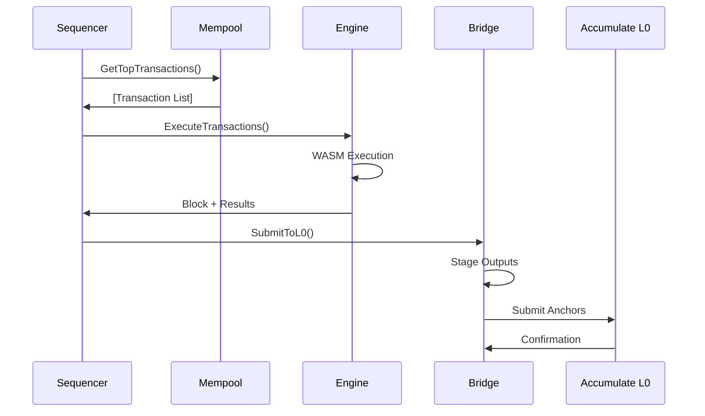

# Accumen Architecture

Accumen is a Layer 1 sequencer designed to provide deterministic WASM execution with seamless integration to the Accumulate Layer 0 network. This document outlines the high-level architecture and key components.

## Overview

```
┌─────────────────────────────────────────────────────────────────┐
│                          Accumen L1                            │
├─────────────────────────────────────────────────────────────────┤
│  ┌─────────────┐  ┌─────────────┐  ┌─────────────┐            │
│  │  Mempool    │  │ Sequencer   │  │   Engine    │            │
│  │   (Tx       │  │   Loop      │  │   (WASM     │            │
│  │  Ordering)  │  │             │  │ Execution)  │            │
│  └─────────────┘  └─────────────┘  └─────────────┘            │
│         │                 │                 │                  │
│         └─────────────────┼─────────────────┘                  │
│                           │                                    │
│  ┌─────────────────────────────────────────────────────────┐   │
│  │                Bridge Layer                            │   │
│  │  ┌─────────────┐  ┌─────────────┐  ┌─────────────┐    │   │
│  │  │   Output    │  │   Output    │  │    L0 API   │    │   │
│  │  │  Staging    │  │ Submission  │  │   Client    │    │   │
│  │  └─────────────┘  └─────────────┘  └─────────────┘    │   │
│  └─────────────────────────────────────────────────────────┘   │
├─────────────────────────────────────────────────────────────────┤
│                     Accumulate L0                              │
│              (Directory Network & Validators)                  │
└─────────────────────────────────────────────────────────────────┘
```

## Core Components

### 1. Sequencer Loop (`sequencer/loop.go`)

The main orchestrator that coordinates all subsystems:

- **Block Production**: Creates blocks at regular intervals
- **Transaction Processing**: Manages the flow from mempool to execution
- **State Management**: Maintains current block height and sequencer state
- **Bridge Integration**: Coordinates with L0 bridge for anchoring

**Key Responsibilities:**
- Fetch transactions from mempool
- Execute transactions via the engine
- Submit results to L0 bridge
- Generate metadata and receipts

### 2. Mempool (`sequencer/mempool.go`)

Priority-based transaction pool with account-level limits:

- **Priority Queuing**: Orders transactions by gas price and priority
- **Account Limits**: Prevents spam from individual accounts
- **Automatic Cleanup**: Removes expired and invalid transactions
- **Gas Estimation**: Integrates with credit manager for pricing

**Features:**
- Thread-safe concurrent access
- Configurable size and age limits
- Account-based transaction limiting
- Priority-based ordering

### 3. Execution Engine (`sequencer/exec.go`)

Multi-worker transaction execution with WASM runtime:

- **Parallel Processing**: Multiple workers for concurrent execution
- **WASM Integration**: Deterministic execution via wazero runtime
- **Gas Metering**: Precise gas consumption tracking
- **State Management**: Thread-safe key-value store

**Architecture:**
- Worker pool for parallel execution
- Queue-based task distribution
- Deterministic WASM runtime
- Gas limit enforcement

### 4. AccuWASM Runtime (`engine/runtime/`)

Deterministic WASM execution environment:

#### Host API (`engine/host/abi.go`)
- **State Operations**: `get`, `set`, `delete`, iterator functions
- **Transaction Context**: Access to tx ID, sender, data
- **Gas Functions**: Remaining gas, gas consumption
- **Block Context**: Height, timestamp access
- **Logging**: Structured logging from WASM

#### Runtime (`engine/runtime/runtime.go`)
- **Wazero Integration**: Deterministic WASM execution
- **Memory Limits**: Configurable memory constraints
- **Gas Metering**: Integration with gas meter
- **Module Loading**: WASM bytecode compilation and caching

#### Host Bindings (`engine/runtime/host_bindings.go`)
- **Function Registration**: Maps host functions to WASM imports
- **Type Safety**: Proper parameter and return type handling
- **Error Handling**: Safe error propagation

### 5. Bridge Layer (`bridge/`)

Connects Accumen to Accumulate L0 network:

#### L0 API Client (`bridge/l0api/`)
- **JSON-RPC Client**: Accumulate API v3 integration
- **Query Operations**: Account, transaction, directory queries
- **Retry Logic**: Robust error handling and retries
- **Health Monitoring**: Connection health checks

#### Output Management (`bridge/outputs/`)
- **Staging**: Batches outputs for efficient submission
- **Submission**: Multi-worker submission pipeline
- **Verification**: Cryptographic verification of outputs
- **Limits**: Resource and rate limiting

#### Anchoring (`bridge/anchors/`)
- **DN Writer**: Writes transaction metadata to Directory Network
- **Metadata Builder**: Constructs structured metadata from receipts
- **Batch Processing**: Efficient batch submission
- **Cost Calculation**: Integration with credit pricing

#### Pricing (`bridge/pricing/`)
- **Credit Management**: ACME credit system integration
- **Dynamic Pricing**: Gas and priority-based pricing
- **Cost Estimation**: Transaction cost prediction

### 6. Registry Integration (`registry/dn/`)

Directory Network client for protocol parameters:

- **Gas Schedule**: Retrieves current gas costs
- **Opcode Table**: Gets supported WASM opcodes
- **Reserved Labels**: Checks for reserved account names
- **Anchor Submission**: Submits anchors to DN

### 7. State Management (`engine/state/`)

Thread-safe state storage and receipts:

#### KV Store (`engine/state/kv.go`)
- **Thread Safety**: Concurrent read/write operations
- **Iterator Support**: Prefix-based key iteration
- **Memory Efficiency**: Optimized for high-throughput

#### Receipts (`engine/state/receipt.go`)
- **Execution Records**: Complete execution metadata
- **State Changes**: Detailed diff tracking
- **Gas Accounting**: Precise gas consumption records
- **Log Aggregation**: Structured log collection

### 8. Type System (`types/`)

Structured data types and code generation:

#### JSON Schema (`types/json/`)
- **Metadata Schema**: Transaction metadata structure
- **Builder**: Constructs metadata from receipts
- **Validation**: Schema compliance checking
- **Serialization**: JSON marshaling/unmarshaling

#### Protocol Buffers (`types/proto/`)
- **Receipt Definitions**: Binary-efficient receipt format
- **Block Structures**: Block and transaction definitions
- **Code Generation**: Auto-generated Go types

## Data Flow

### Transaction Lifecycle

1. **Submission**: Transaction submitted via API
2. **Validation**: Basic validation (signature, format)
3. **Mempool**: Added to priority queue
4. **Selection**: Picked by sequencer for block
5. **Execution**: WASM execution with gas metering
6. **State Update**: KV store updated with changes
7. **Receipt**: Execution receipt generated
8. **Metadata**: Structured metadata created
9. **Anchoring**: Submitted to L0 for finality

### Block Production Flow



## Key Design Principles

### 1. Determinism
- **WASM Constraints**: No floats, time, syscalls, random
- **Gas Metering**: Deterministic execution limits
- **State Isolation**: Each transaction sees consistent state

### 2. Performance
- **Parallel Execution**: Multi-worker architecture
- **Batch Processing**: Efficient L0 submission
- **Memory Management**: Bounded memory usage
- **Gas Optimization**: Minimal overhead operations

### 3. Reliability
- **Error Handling**: Comprehensive error propagation
- **Retry Logic**: Robust network operation retries
- **Health Checks**: System health monitoring
- **Graceful Shutdown**: Clean resource cleanup

### 4. Extensibility
- **Plugin Architecture**: Modular component design
- **Configuration**: Extensive configuration options
- **Feature Flags**: Runtime feature toggling
- **Metrics**: Comprehensive observability

## Security Considerations

### 1. WASM Sandboxing
- **Memory Isolation**: WASM linear memory constraints
- **Function Whitelisting**: Limited host function access
- **Gas Limits**: Prevent infinite loops/DoS
- **Deterministic Execution**: No non-deterministic operations

### 2. Network Security
- **TLS Support**: Encrypted communication
- **Rate Limiting**: DoS protection
- **Input Validation**: Comprehensive input sanitization
- **Auth Integration**: Pluggable authentication

### 3. State Security
- **Atomic Updates**: All-or-nothing state changes
- **Checkpoints**: State snapshot capabilities
- **Audit Trail**: Complete transaction history
- **Verification**: Cryptographic output verification

## Namespace Policy & Registrar

### Overview

Accumen enforces reserved namespace rules to prevent unauthorized use of protected contract namespaces. The system integrates with the Accumulate Directory Network (DN) registry to validate contract deployment and execution permissions.

### Architecture

```
┌─────────────────────────────────────────────────────────────────┐
│                    Namespace Enforcement                        │
├─────────────────────────────────────────────────────────────────┤
│  ┌─────────────┐  ┌─────────────┐  ┌─────────────┐            │
│  │ RPC Server  │  │  Execution  │  │ Namespace   │            │
│  │ Validation  │  │   Engine    │  │  Manager    │            │
│  │             │  │ Validation  │  │             │            │
│  └─────────────┘  └─────────────┘  └─────────────┘            │
│         │                 │                 │                  │
│         └─────────────────┼─────────────────┘                  │
│                           │                                    │
│  ┌─────────────────────────────────────────────────────────┐   │
│  │               DN Registry Integration               │   │
│  │  ┌─────────────┐  ┌─────────────┐  ┌─────────────┐    │   │
│  │  │ Reserved    │  │ Contract    │  │   L0 API    │    │   │
│  │  │Namespaces   │  │ Registry    │  │  Querier    │    │   │
│  │  └─────────────┘  └─────────────┘  └─────────────┘    │   │
│  └─────────────────────────────────────────────────────────┘   │
├─────────────────────────────────────────────────────────────────┤
│                     Accumulate DN Registry                     │
│  acc://dn.acme/accumen/namespaces/reserved                    │
│  acc://dn.acme/accumen/contracts/[contract-url]               │
└─────────────────────────────────────────────────────────────────┘
```

### Components

#### 1. Namespace Manager (`registry/dn/namespace.go`)

**Functions:**
- `IsReservedNamespace(ctx, namespace) (bool, error)` - Checks if namespace is reserved
- `ContractAllowed(ctx, contractURL) (bool, reason, error)` - Validates contract permissions

**Registry Paths:**
- **Reserved Namespaces**: `acc://dn.acme/accumen/namespaces/reserved`
- **Contract Registry**: `acc://dn.acme/accumen/contracts/%s` (per-contract authorization)

#### 2. Configuration (`internal/config/config.go`)

```yaml
namespace:
  reservedLabel: "accumen"    # Default reserved namespace
  enforce: false              # Enable/disable enforcement
```

**Configuration Options:**
- `reservedLabel`: The namespace label to protect (default: "accumen")
- `enforce`: Whether to enforce namespace restrictions (default: false)

#### 3. Enforcement Points

**Contract Deployment** (`internal/rpc/server.go`):
- Validates namespace permissions before saving contract to store
- Rejects deployment if contract URL uses reserved namespace without authorization

**Transaction Execution** (`internal/rpc/server.go`):
- Validates namespace permissions before adding transactions to mempool
- Prevents execution of transactions targeting unauthorized contracts

### Authorization Model

#### Reserved Namespace Detection

Namespace is extracted from contract URLs:
- `acc://mycontract.accumen` → namespace: `accumen`
- `acc://test.service` → namespace: `service`
- `acc://simple` → no namespace (allowed)

#### Authorization Flow

1. **Extract Namespace**: Parse namespace from contract URL
2. **Check Reserved List**: Query DN for reserved namespaces
3. **If Not Reserved**: Allow deployment/execution
4. **If Reserved**: Check contract registry for authorization
5. **Authorization Status**:
   - `authorized`: Explicitly permitted
   - `denied`: Explicitly blocked
   - `not_found`: No registry entry (blocked for reserved namespaces)

#### Registry Entry Format

**Reserved Namespaces List** (`acc://dn.acme/accumen/namespaces/reserved`):
```
accumen
system
admin
```

**Contract Authorization** (`acc://dn.acme/accumen/contracts/[contract-url]`):
```
status:authorized
authorized_by:accumen-foundation
reason:Core protocol contract
expires:2025-12-31
```

### Security Model

#### Threat Protection

1. **Namespace Squatting**: Prevents unauthorized use of reserved namespaces
2. **Brand Protection**: Protects official protocol namespaces
3. **Registry Integrity**: Uses DN immutable registry for authorization records

#### Access Control

- **Permissionless Namespaces**: Anyone can deploy contracts to non-reserved namespaces
- **Reserved Namespaces**: Require explicit authorization in DN registry
- **Authorization Granularity**: Per-contract URL authorization
- **Registry Updates**: Controlled by DN governance/authority

### Operational Considerations

#### Performance Impact

- **Caching**: Registry queries cached for 30 seconds by default
- **Fallback**: System allows deployment if DN is unreachable (configurable)
- **Batch Validation**: Future enhancement for batch namespace validation

#### Monitoring & Alerting

- **Rejected Deployments**: Log namespace violations for monitoring
- **Registry Access**: Monitor DN registry availability
- **Authorization Changes**: Track registry updates and changes

#### Configuration Management

**Development Mode**: Disable enforcement for testing
```yaml
namespace:
  enforce: false
```

**Production Mode**: Enable enforcement with monitoring
```yaml
namespace:
  enforce: true
  reservedLabel: "accumen"
```

## Deployment Architecture

### Single Node Deployment
```
┌─────────────────────────────────────┐
│           Accumen Node              │
│  ┌─────────────────────────────┐    │
│  │        Sequencer            │    │
│  │  ┌─────┐  ┌─────┐  ┌─────┐  │    │
│  │  │Mem- │  │Exec-│  │Bridge│  │    │
│  │  │pool │  │ution│  │      │  │    │
│  │  └─────┘  └─────┘  └─────┘  │    │
│  └─────────────────────────────┘    │
│  ┌─────────────────────────────┐    │
│  │         APIs                │    │
│  │  REST │ gRPC │ WebSocket    │    │
│  └─────────────────────────────┘    │
└─────────────────────────────────────┘
```

### Multi-Node Deployment
```
┌─────────────┐  ┌─────────────┐  ┌─────────────┐
│ Sequencer   │  │ Follower    │  │ Follower    │
│   Node      │  │   Node      │  │   Node      │
│             │  │             │  │             │
│ ┌─────────┐ │  │ ┌─────────┐ │  │ ┌─────────┐ │
│ │Block    │ │  │ │Block    │ │  │ │Block    │ │
│ │Producer │ │  │ │Sync     │ │  │ │Sync     │ │
│ └─────────┘ │  │ └─────────┘ │  │ └─────────┘ │
└─────────────┘  └─────────────┘  └─────────────┘
       │                │                │
       └────────────────┼────────────────┘
                        │
            ┌─────────────────────┐
            │   Accumulate L0     │
            │  (Shared State)     │
            └─────────────────────┘
```

## Performance Characteristics

### Throughput Targets
- **Transactions**: 1000+ TPS sustained
- **Block Time**: 1-15 seconds configurable
- **Latency**: <100ms transaction confirmation
- **Gas Efficiency**: <1000 gas overhead per operation

### Resource Requirements
- **Memory**: 1-4GB depending on load
- **CPU**: 2-8 cores recommended
- **Storage**: 10GB+ for state and logs
- **Network**: 100Mbps+ for L0 communication

### Scalability Limits
- **Mempool**: 100k+ pending transactions
- **State Size**: Limited by available memory
- **Concurrent Connections**: 10k+ API connections
- **WASM Modules**: 1000+ loaded contracts

## Future Enhancements

### Short Term
1. **State Persistence**: Disk-backed state storage
2. **Consensus**: Multi-node consensus mechanism
3. **Sharding**: Horizontal scaling via sharding
4. **Optimizations**: Performance tuning and optimization

### Long Term
1. **VM Alternatives**: Support for additional VMs (EVM, etc.)
2. **Cross-Chain**: Multi-chain bridge support
3. **Privacy**: Zero-knowledge proof integration
4. **Governance**: On-chain governance mechanisms